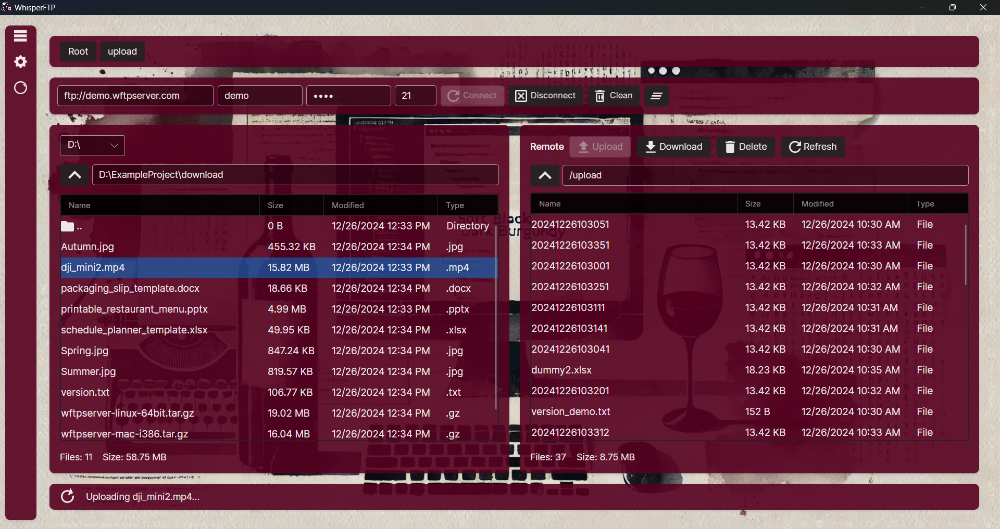
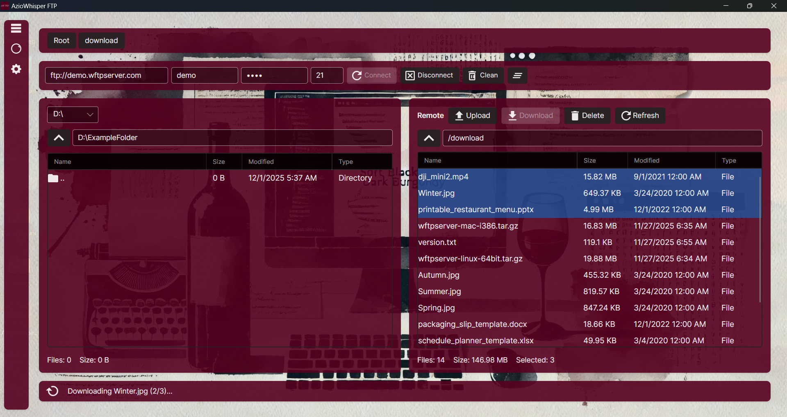
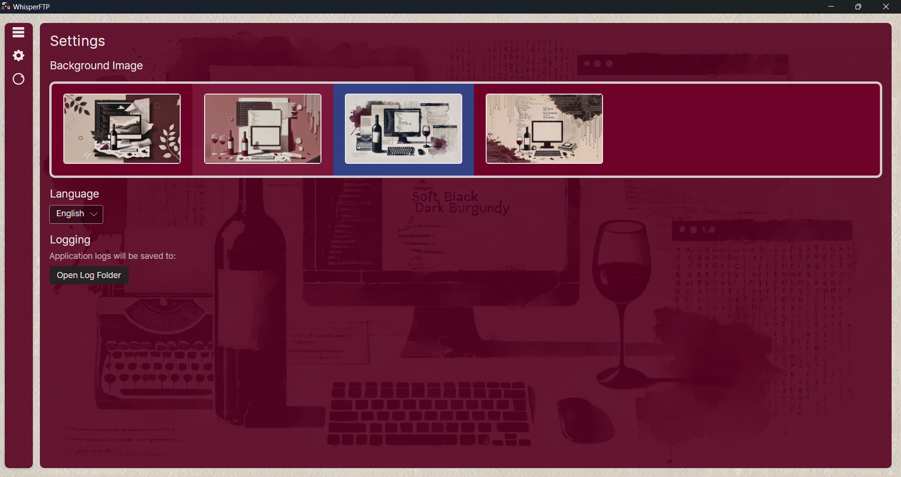
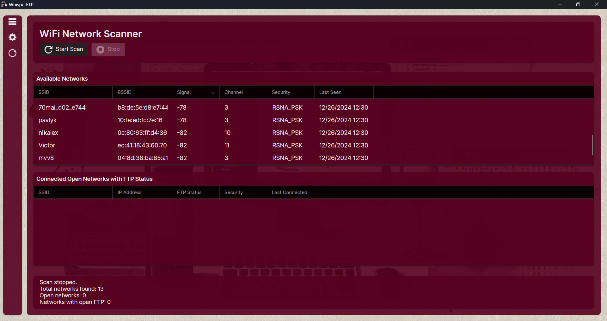
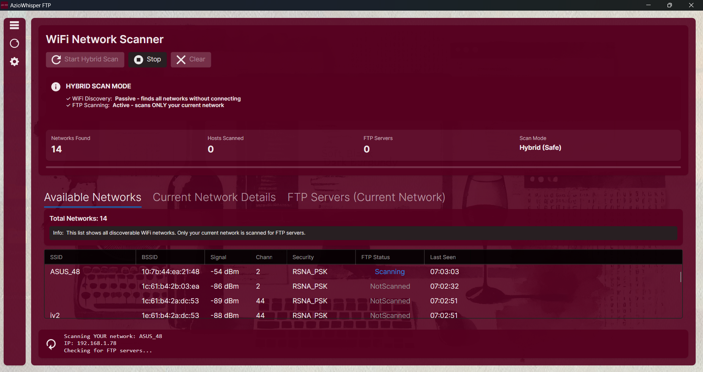
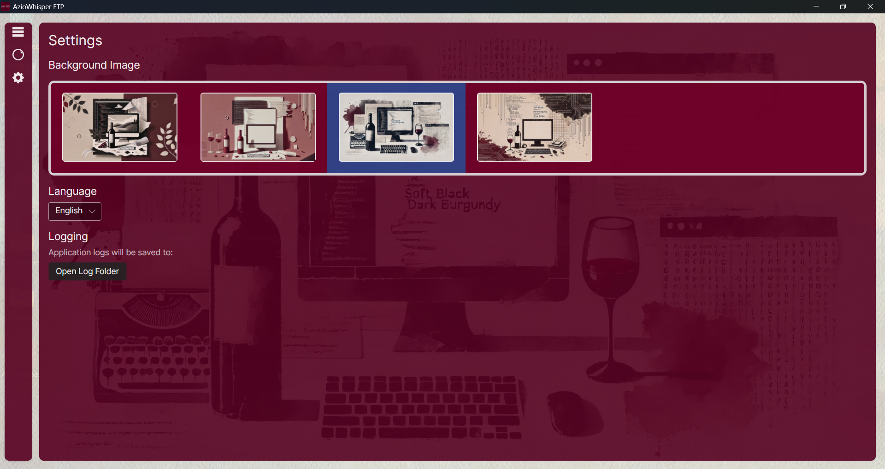

[](https://opensource.org/licenses/MIT)
[](https://dotnet.microsoft.com/download)
[](https://www.microsoft.com/windows)

# AzioWhisper FTP


AzioWhisper FTP is app designed for seamless file management and transfer operations.

## Key Features

### File Management
- **Dual-Pane Interface** - Navigate local and remote files simultaneously
- **Multi-Selection** - Select and transfer multiple files at once

### FTP Operations
- **Full FTP/FTPS Support** - Secure and standard FTP connections powered by FluentFTP
- **Advanced Protocol Support** - Reliable FTP/FTPS connectivity with automatic fallback
- **Resume Transfers** - Continue interrupted downloads/uploads
- **Recursive Operations** - Upload/download entire directory trees
- **Progress Tracking** - Real-time transfer progress indicators
- **Intelligent Retry** - Automatic retry mechanism for failed operations
- **Connection Pooling** - Efficient connection management for better performance

### Network Scanner
- **Hybrid Scan Mode** - Passive WiFi discovery + Active FTP scanning
- **Real-Time Discovery** - Continuous network monitoring

### User Experience
- **Custom Backgrounds** - Personalize your workspace
- **Multi-Language** - English and Russian support
- **Session History** - Recent connections with quick access
- **Comprehensive Logging** - Track all operations
- **Responsive UI** - Smooth animations and transitions

## Application Data Directory

AzioWhisper FTP stores all application data in your Documents folder for easy access and backup:

**Application Data Directory:**
```
%USERPROFILE%\Documents\AzioWhisperFTP\
```

**Database Location:**
```
%USERPROFILE%\Documents\AzioWhisperFTP\Data\DatabaseAzioWhisperFTP.db
```
- Stores connection history, settings, and cached network scan data
- SQLite database format
- Automatically created on first run

**Log Files Location:**
```
%USERPROFILE%\Documents\AzioWhisperFTP\Logs\aziowhisperFTP_YYYYMMDD.log
```
- Daily log files with timestamp (e.g., `aziowhisperFTP_20251201.log`)
- Contains detailed operation logs, errors, and debug information
- Automatically rotated daily
- Safe to delete old log files to free up space








## 🛠️ Technical Stack

| Component | Technology |
|-----------|-----------|
| **Framework** | .NET 9.0 |
| **UI Framework** | Avalonia UI 11.x |
| **Architecture** | MVVM Pattern |
| **FTP Client** | FluentFTP |
| **Reactive Programming** | ReactiveUI + System.Reactive |
| **Database** | SQLite + Entity Framework Core |
| **Networking** | Native WiFi API (ManagedWifi) |
| **Dependency Injection** | Microsoft.Extensions.DependencyInjection |
| **Code Analysis** | SonarAnalyzer, Roslyn Analyzers |

## Contributing

Contributions are welcome. Please fork the repository and create a pull request with your changes.

## Author

Bohdan Harabadzhyu

## License

[MIT](https://choosealicense.com/licenses/mit/)

## Microsoft Store

[](https://apps.microsoft.com/detail/9N73GM6JPBXZ)

## SourceForge
[](https://sourceforge.net/projects/whisperftpapp/files/latest/download)

## YouTube Review
<details>
<summary>📺 Watch Video Review</summary>

[](https://www.youtube.com/watch?v=uSTPpDcKVKc)
</details>
