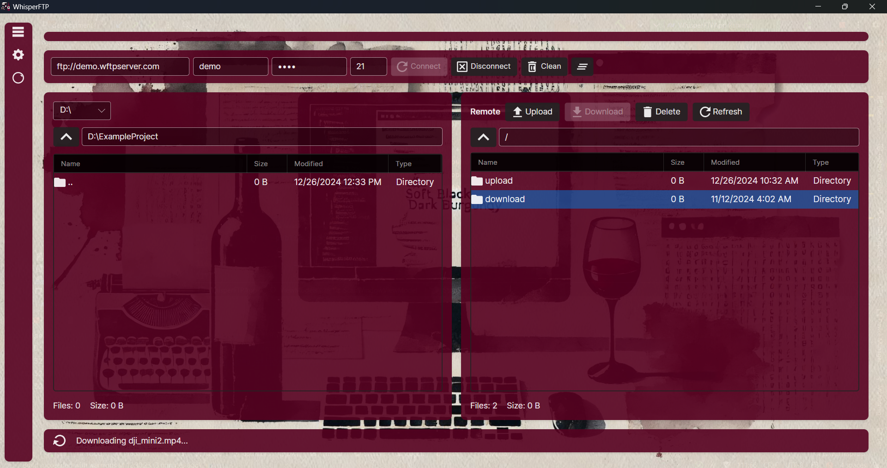

# AzioWhisper FTP

AzioWhisper FTP is app designed for seamless file management and transfer operations.

## Key Features

### File Management
- **Dual-Pane Interface** - Navigate local and remote files simultaneously
- **Multi-Selection** - Select and transfer multiple files at once

### FTP Operations
- **Full FTP/FTPS Support** - Secure and standard FTP connections
- **Resume Transfers** - Continue interrupted downloads/uploads
- **Recursive Operations** - Upload/download entire directory trees
- **Progress Tracking** - Real-time transfer progress indicators

### Network Scanner
- **Hybrid Scan Mode** - Passive WiFi discovery + Active FTP scanning
- **Real-Time Discovery** - Continuous network monitoring

### User Experience
- **Custom Backgrounds** - Personalize your workspace
- **Multi-Language** - English and Russian support
- **Session History** - Recent connections with quick access
- **Comprehensive Logging** - Track all operations
- **Responsive UI** - Smooth animations and transitions

## 🛠️ Technical Stack

| Component | Technology |
|-----------|-----------|
| **Framework** | .NET 9.0 |
| **UI Framework** | Avalonia UI 11.x |
| **Architecture** | MVVM Pattern |
| **Reactive Programming** | ReactiveUI + System.Reactive |
| **Database** | SQLite + Entity Framework Core |
| **Networking** | Native WiFi API (ManagedWifi) |
| **Dependency Injection** | Microsoft.Extensions.DependencyInjection |
| **Code Analysis** | SonarAnalyzer, Roslyn Analyzers |

## Contributing

Contributions are welcome. Please fork the repository and create a pull request with your changes.

## Author

Bohdan Harabadzhyu

## License

[MIT](https://choosealicense.com/licenses/mit/)

## YouTube Review

📺 Watch Video Review

## SourceForge

